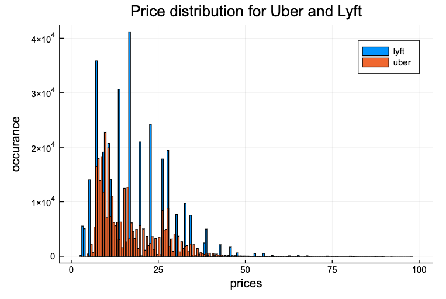
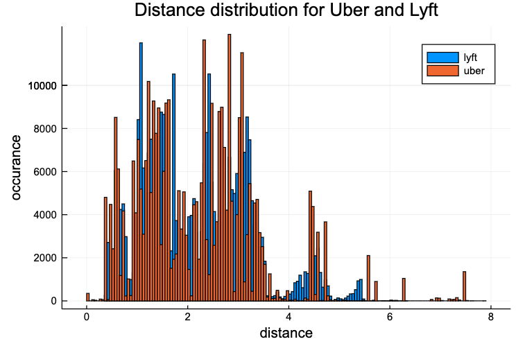

# Midterm Report

## Introduction

In the report, you should describe your data set in greater detail.

- Describe how you plan to avoid over (and under-)fitting, and
- how you will test the effectiveness of the models you develop.
- [checked] Include a few histograms or other descriptive statistics about the data.
- [checked] How many features and examples are present?
- [checked] How much data is missing or corrupted? How can you tell?
- You should also run a few preliminary analyses on the data, including perhaps some regressions or other supervised models, describing how you chose which features (and transformations) to use.
- explain what remains to be done
- how you plan to develop the project over the rest of the semester.

In this project, we look at what factors infuence the price of ride-sharing. Specifically, with the data on Uber and Lyft rides, we train a model that takes factors including the platform, time, day of the week, weather, distance, model of the ride, etc, to predict the price of the ride.

### The data

We have a sample size of 693,071, with 56% Uber rides and 44% Lyft rides during November to December, 2018 in Boston. There are 57 features in total. For a quick glance of the difference between pricing for each ride sharing platform, we plotted a histogram of price.

## Current progress

### Data cleaning

There are in total 55095 entries contain missing data, which comprises of 0.79% of all data. With the histogram and a look at the min and max values of each column, we believe that all other data are within reasonable range.
We split all data into two parts. 80% of data is training data and the rest is testing data.
We got rid of all missing values in the table and changed the datatype of one column from string to float. We also combined the columns "month" and "day" into one column "day_of_week", because we believe that the actual number of the date is not as indicative as the day of the week. We then standardized all real columns and used one-hot encoding for boolean and categorical data.

###

## Future plans
